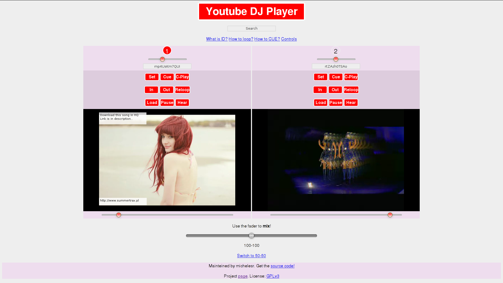

# YTDJ

Try it [here](https://michelesr.github.io/ytdj/)!

## Usage

### Loading the videos

In order to start a video in a player you must provide the video `id` (for
example `https://www.youtube.com/watch?v=An2a1_Do_fc` has `An2a1_Do_fc` as `id`)
and click `Load`.  You can also provide the video `url`, the software will try
to parse it and get the `id`.

### Search

This feature is disabled because it requires a valid 
[Google API key](https://support.google.com/cloud/answer/6158862?hl=en). If you
really want to use it you can download the source code and replace the key
in `src/yt-search.js` with your own key.

~~Now you can use the search to find videos and load them on the selected
player by clicking on the result box. To select the target player click on its
number.~~

### Mixing

Use the `fader` to mix audio! You can set local volume for a video using the
control provided (please don't use youtube volume control). There are two fader
modes: `50-50` and `100-100` and they refers to the value of the volumes when
the mixer is on the middle position.

### Looping

To loop a video, click `In` to get initial time, `Out` to take final time and
start the loop, `Exit` to finish the loop, `Reloop` to retrigger the same loop.
The loop won't start if final time is lower than start time.

### Cue

Click `Pause` to pause the video, then seek to the desired point usign
youtube timeline, click `Hear` to hear the audio in the seeked position, when
you found the right position click `Set` to set the cue, then you can hold `Cue`
or click `C-Play` to play the track from the `Cue` position, the difference is that
`Cue` will stop the track when you stop holding.

### Hiding the videos

Hide/Show the videos pressing `H`.

## Credits

**michelesr**, **rikynd**
